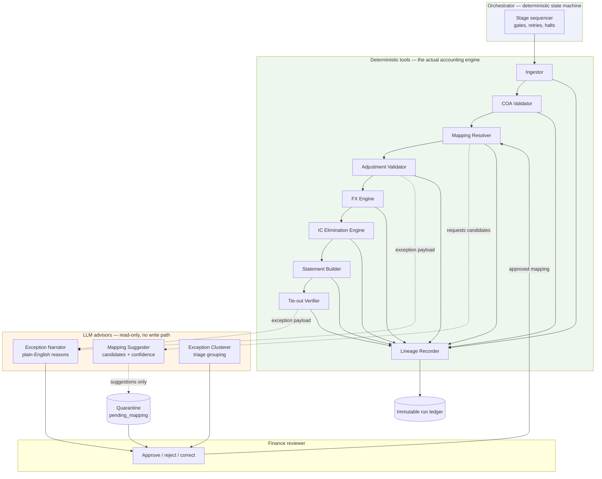

# Architecture — ERP-Driven Financial Statement Generation

**Scope of this document.** This describes the full system: trial balance + chart of accounts + manual adjustments in, four audited statements out. Section 12 describes the one slice built end-to-end for this submission (the manual-adjustment validator). Everything else is design, deliberately not built.

**One-line summary of the position taken here.** Financial statement generation is a deterministic accounting pipeline wrapped in a thin agentic control layer. The LLM never touches a number, never creates a mapping, and never has a write path to posted output. It earns its keep on ambiguity, explanation, and triage — the three places where deterministic code has nothing useful to say.

## Executive summary

- Financial statement generation decomposes into multiple sub-problems, most of which require deterministic controls rather than model autonomy.
- The proposed architecture uses a deterministic orchestrator and accounting tools, with LLMs limited to read-only advisory roles for suggestions, explanations, and triage.
- Hard release gates enforce traceability, idempotency, human review, and all-or-nothing output release.
- The working prototype implements one slice end-to-end: manual-adjustment validation with `ACCEPT`, `REJECT`, and `ESCALATE` outcomes.
- Auditability is a first-class requirement: every decision is tied to source rows, rule codes, input hashes, and a reproducible run record.

---

## 1. Reading guide

| Section | Answers |
|---|---|
| 2 | What the sub-problems actually are |
| 3 | Agent topology and why not a swarm |
| 4 | The pipeline, stage by stage |
| 5 | Deterministic vs LLM boundary |
| 6 | Defects found in the supplied bundle |
| 7 | Production failure modes |
| 8 | Validation and self-correction loop |
| 9 | Auditor traceability, with a worked example |
| 10 | Run state, idempotency, reproducibility |
| 11 | Human-in-the-loop workflow |
| 12 | What was actually built |
| 13 | Scale and multi-entity consolidation |
| 14 | Open questions and recorded assumptions |

---

## 2. Problem decomposition

"Generate financial statements" is not one problem. It is at least eight, with materially different reliability requirements. Grouping them under one agent is the core design error to avoid.

| # | Sub-problem | Nature | Tolerance for error | Owner |
|---|---|---|---|---|
| 1 | Source ingestion, schema drift, encoding, period identification | Mechanical | Zero | Deterministic |
| 2 | COA structure validation (hierarchy, posting vs header, orphan nodes) | Structural | Zero | Deterministic |
| 3 | TB → COA mapping for unmapped / renamed / ambiguous accounts | **Judgment** | Bounded, must be reviewable | LLM proposes, human approves |
| 4 | Manual journal validation (line and entry level) | Rule-based | Zero | Deterministic |
| 5 | FX translation and revaluation | Arithmetic + policy | Zero arithmetic, policy configurable | Deterministic |
| 6 | Intercompany elimination and circularity detection | Graph + judgment | Detect deterministically, resolve with human | Hybrid |
| 7 | Statement assembly (BS, P&L, CF, SOCIE) and cross-statement tie-outs | Arithmetic | Zero | Deterministic |
| 8 | Traceability, reviewer workflow, explanation | Presentation | Must never misstate | Deterministic lineage, LLM narration |

Note what falls out of this table: only rows 3 and 6 have genuine judgment content, and row 8 has a narration component. **Six of eight sub-problems should never see a language model.** That observation drives the whole topology.

---

## 3. Agent topology

### 3.1 The choice

**A single orchestrator over deterministic tools, plus three narrowly-scoped LLM advisors that hold no write capability.**

This is not "one agent with tools" (the orchestrator is a state machine, not a model deciding what to call next) and it is not a sub-agent swarm (Mapper / Adjuster / Builder / Validator as autonomous agents). It is closer to a workflow engine with three advisory endpoints.



### 3.2 Why not autonomous sub-agents

The brief warns against a 12-agent swarm, and the warning is correct for a reason worth stating precisely: **an autonomous agent is only justified where the next action cannot be determined in advance.** In this pipeline it always can. Ingestion always precedes COA validation, which always precedes mapping, which always precedes adjustment validation. There is no planning problem to solve. Handing that fixed sequence to a model buys nothing and costs determinism, reproducibility, and the ability to state "this run will produce the same output as the last one."

Autonomy would also put a model in a position to skip a control. That is unacceptable in software whose output is signed by a CFO.

### 3.3 Why not a single monolithic agent with tools

A model choosing tools freely can call the statement builder before adjustments have cleared, or return output when a tie-out failed. The gates in section 8 are only enforceable if something other than a model enforces them.

### 3.4 What the orchestrator actually is

A stage sequencer with four responsibilities: run stages in order, evaluate the gate after each, route failures (halt / quarantine / escalate), and write every transition to the run ledger. It is ordinary code. It is boring on purpose.

### 3.5 Where sub-agents *would* be justified

If the product later needs open-ended reconciliation research — "explain why this entity's opening equity moved and go find the evidence" — that is a genuine search problem with no fixed plan, and a bounded research sub-agent with read-only tool access becomes defensible. It stays out of the posting path.

---

## 4. The pipeline

### S0 — Run initialization
Assign an immutable `run_id`. Hash every input file (SHA-256). Record period, entity, functional currency, policy version, validator version, timestamp. Any later output that cannot name these is not releasable.

### S1 — Ingestion
Load TB, prior-period TB, COA, adjustments, FX rates **without cleaning**. Duplicates, orphans, and malformed rows are retained and flagged, never silently dropped. Rationale: a row that disappears during ingestion is invisible to the auditor, and the defect it represents is now the system's defect rather than the source's.

Per-row provenance is attached at this stage: `(file_hash, line_number, raw_values)`. Nothing downstream may create a figure that cannot point back to one of these tuples.

### S2 — COA structure validation
Build the account tree. Check: every node has a statement classification (BS/PL); posting accounts are leaves; header nodes are not used for posting; cash-flow category present for accounts requiring one; no cycles; no node with an ambiguous or conflicting classification; flag nodes with no mapped children.

### S3 — Mapping resolution
Three-tier resolution:

1. **Exact match** on account code → deterministic, confidence 1.0, no model involved.
2. **Deterministic alias** from an approved mapping table (this is where a renamed account resolves once a human has approved the rename) → confidence 1.0.
3. **Unresolved** → the LLM Mapping Suggester is asked for ranked candidates with confidence scores and stated evidence (name similarity, sibling accounts, prior-period position, typical balance sign).

Tier 3 output goes to `pending_mapping` quarantine. It is never applied automatically at any confidence. A high confidence score changes reviewer ordering, not authority. Approved mappings are written to the alias table with approver identity and timestamp, which converts the account to tier 2 permanently — the model is consulted once per novel account across the product's lifetime, not once per run.

**Unmapped accounts block statement release.** They do not get a "Other / Unclassified" bucket, because that bucket is how a balance sheet silently becomes wrong.

### S4 — Adjustment validation
Line level: account exists; account is a posting account; amount is single-sided, non-zero, non-negative; date falls in the open period. If line-level currency were introduced in this slice, it would be validated deterministically rather than inferred.
Entry level: debits equal credits within tolerance; same-account debit-and-credit patterns flagged; duplicate entry keys detected; IC entries checked for circularity.
Outcome per entry: `ACCEPT` / `REJECT` / `ESCALATE`. Rejected and escalated entries are excluded from downstream figures entirely — no partial posting. In the prototype slice, accepted entries are then replayed into the functional-currency TB and rechecked for post-adjustment balance as a release-readiness control.

### S5 — FX
Translate non-functional balances using policy-specified rates: period-end (closing) for balance sheet monetary items, period-average for P&L, historic for equity. Compute revaluation differences explicitly rather than plugging them.

A missing rate is a **hard control failure**, never an estimate, never an interpolation, never a fallback to the prior period. Any translated figure records which rate, which rate date, and which source row produced it.

### S6 — Intercompany elimination
Build a directed graph of IC balances across entities. Match counterparties, eliminate matched pairs, and report unmatched residuals as exceptions rather than absorbing them. Detect cycles (A→B→C→A) and flag them for human resolution — a cycle may be legitimate netting or may be a routing error, and the difference is not determinable from the data.

### S7 — Statement assembly
Roll leaf balances up the COA tree. Build P&L first (net income is an input to both the balance sheet and SOCIE), then the balance sheet, then SOCIE (opening equity → net income → OCI → movements → closing), then cash flow (indirect method: net income adjusted for non-cash items and working-capital deltas derived from current vs prior TB).

Ordering matters because the tie-outs in section 8 depend on it.

### S8 — Verification gate and release
See section 8. Output is either released with a full lineage bundle or withheld with a reason list. There is no third state.

---

## 5. Deterministic vs LLM boundary

This is the question the brief asks most directly: *generating a balance sheet from a clean TB is arithmetic — where does the AI actually earn its keep?*

### 5.1 Answer

The AI earns its keep in exactly three places, all of them outside the number path:

**1. Candidate generation for unmapped accounts.** An orphan account named `Accrued Prof Fees - Legal` with no COA code match is a semantic problem, not an arithmetic one. Fuzzy string matching produces poor candidates; a model reasoning over account name, sibling accounts, prior-period placement, balance sign, and typical activity produces good ones. The value is *recall on the reviewer's shortlist* — turning a 30-minute manual hunt into a 20-second confirmation. The model is doing retrieval-with-judgment, not deciding.

**2. Plain-English explanation of already-detected exceptions.** Deterministic code knows `entry ADJ-007: debit 45,200.00, credit 45,020.00, diff 180.00, rule E-BAL-01`. A finance reviewer wants "this accrual reversal is out of balance by 180.00 — the credit line for account 2100 appears to be missing a digit, since 45,020 versus 45,200 is a transposition." The model never determines *that* there is an error or *how large* it is; it renders a structured finding into sentences, with the numbers passed in as fixed tokens it is instructed not to alter.

**3. Exception clustering and triage.** Two hundred exceptions across a close is a workload problem. Grouping them into "eight are the same missing FX rate," "twelve are one renamed account," "three need real investigation" is a genuine value-add that no rule set gives you for free.

### 5.2 Boundary table

| Operation | Owner | Non-negotiable |
|---|---|---|
| Parsing, typing, encoding | Deterministic | |
| Arithmetic of any kind | Deterministic | LLM output is never cast to a number |
| COA lookup, hierarchy walk | Deterministic | |
| Debit/credit balance check | Deterministic | |
| Date and period validation | Deterministic | |
| Duplicate detection | Deterministic | |
| FX rate selection and application | Deterministic | |
| IC matching and cycle detection | Deterministic | |
| Statement roll-up, tie-outs | Deterministic | |
| Accept / reject / escalate decision | Deterministic | |
| Mapping *candidates* | LLM | Suggestion only, quarantined |
| Exception *narration* | LLM | Numbers injected, not generated |
| Exception *clustering* | LLM | Advisory ordering only |

### 5.3 Hard prohibitions

The LLM may not: invent or apply an account mapping; alter, restate, or recompute any amount; approve a failed control; write to any posted artifact; or determine a final entry status. Its outputs are typed as `Suggestion` objects that the type system does not permit into the posting path.

### 5.4 Guarding the narration path

Narration is the sneakiest risk, because a fluent wrong sentence about a correct number is still a wrong statement to an auditor. Mitigations: numbers are passed as pre-formatted strings and the prompt forbids arithmetic; generated text is checked to contain only numerals present in the source payload; every narration is stored alongside the structured finding it describes, and the structured finding is authoritative in any conflict.

---

## 6. Defects observed in the supplied bundle

The brief states that not every seeded defect was listed. Below is what this design handles, separating the documented ones from those found by inspection.

**Documented in the brief**

| Defect | Handling |
|---|---|
| TB unbalanced after FX rounding | Control failure with exact difference; compared against a configured rounding tolerance; if within tolerance, post to a named rounding account — never absorbed silently |
| Duplicate account code in TB | Both rows retained, flagged `SRC-DUP-01`; not summed automatically, since duplication may be genuine multi-currency or a genuine export error |
| Orphan account not in COA | Blocks release; routed to mapping quarantine |
| Two COA accounts ambiguous category | Structural failure `COA-AMB-01`; reviewer must resolve; no default classification |
| COA node with no children mapped | Flagged; roll-up to that node yields zero and would otherwise pass silently |
| One adjustment debit ≠ credit | Rejected with exact difference and line-level detail |
| One adjustment references unknown account | Rejected, missing code named |
| One circular intercompany entry | Escalated, never auto-accepted |
| Prior-period account renamed | Detected as prior-only + current-only pair; proposed as an alias with evidence; requires approval, because a rename and a genuine closure/opening look identical in the data |
| Missing period-end FX rate | Hard control failure; no estimation |

**Additional classes assumed present and defended against**

- Sign convention inconsistency (credits as negatives in some rows, positive with a DR/CR flag in others)
- Whitespace, case, and leading-zero variation in account codes — a common cause of false orphans
- Multiple currencies against one account code, indistinguishable from a true duplicate without a currency dimension in the key
- Adjustments dated outside the stated period
- Header-level accounts used for posting
- Comparative mismatch where prior-period totals do not equal last period's published closing figures (a restatement, which must be disclosed rather than smoothed)

**Policy that covers the unlisted ones:** any input row that cannot be fully typed, fully mapped, and fully reconciled becomes an exception. The default is never "proceed with best guess." This is why the ingestion stage refuses to clean.

---

## 7. Production failure modes

| Failure | Why it kills you | Design response |
|---|---|---|
| **Hallucinated account mapping** | A plausible-but-wrong mapping moves a real balance to the wrong statement line; arithmetic still ties, so nothing catches it | Model cannot apply mappings at all. Quarantine + human approval + approved mappings persisted as deterministic aliases with approver identity |
| **Debits ≠ credits after adjustments** | Statements do not balance, or worse, are force-balanced | Entry-level check pre-posting with exact difference; rejected entries excluded wholesale; post-adjustment TB re-verified before assembly |
| **Account fits no COA node** | Silently bucketed into "Other," understating a real line | Release blocked. No unclassified bucket exists in the schema |
| **FX gap** | An interpolated rate produces a defensible-looking but unsupportable number | Hard failure. No estimation, no carry-forward, no interpolation |
| **Circular intercompany entry** | Infinite elimination loop or double-counted elimination | Graph cycle detection pre-elimination; cycles escalate to a human |
| **Rounding drift across roll-up** | Sub-cent errors accumulate to visible statement differences | Integer minor-units (or `Decimal`) throughout; rounding applied once at presentation; rounding differences posted to a named account |
| **Silent schema drift from the ERP** | A renamed column quietly nulls a field | Schema contract validated at ingestion with explicit version; unknown/missing columns halt the run |
| **Non-deterministic model output in the path** | Two runs, two answers, no audit story | Model output is never in the path; the deterministic pipeline is idempotent for a fixed input bundle and policy version |
| **Prior-period restatement treated as an error** | Real restatements get "corrected" away | Comparative mismatch is a disclosable event routed to a human, not an exception to fix |
| **Partial success** | Half a close is worse than none | All-or-nothing release gate |

---

## 8. Validation and self-correction loop

### 8.1 What is checked before anything is returned

Three tiers, each a hard gate.

**Tier 1 — Source controls (after S1/S2)**
- TB debits equal credits within configured tolerance
- Every TB account resolves to a COA posting node
- No unresolved duplicate account/currency keys
- FX rate coverage complete for every non-functional currency and every required rate type
- COA acyclic, classifications complete and unambiguous
- Prior-period TB reconcilable to current account set

**Tier 2 — Transaction controls (after S4/S5/S6)**
- Every adjustment entry balanced within tolerance
- No posting to header accounts, no invalid dates, no malformed amounts
- IC graph acyclic; unmatched IC residuals reported
- Post-adjustment TB still balanced

**Tier 3 — Statement tie-outs (after S7)**
- Assets = Liabilities + Equity
- P&L net income equals the net income line in SOCIE
- SOCIE closing equity equals balance sheet equity
- Cash flow closing cash equals balance sheet cash
- Sum of statement line items equals sum of underlying mapped TB balances (the *completeness* check — proves nothing was dropped in roll-up)
- Prior-period comparatives tie to prior-period source

The completeness check is the one most often omitted and the one that catches the worst class of bug: an account that maps nowhere and therefore appears in no total while every other tie-out still passes.

### 8.2 What happens when a check fails

Failures are classified, and the classification determines the response:

| Class | Example | Response |
|---|---|---|
| **Deterministically correctable** | Sign convention normalization, whitespace in codes, known alias hit | Apply the documented transformation, record it in the ledger as an applied correction, re-run the gate. Bounded: a stage may re-run at most twice, and only via transformations from a fixed registry |
| **Human-correctable** | Unbalanced entry, missing FX rate, unmapped account | Quarantine the affected records, emit a structured exception plus narration, halt release, await correction |
| **Judgment-required** | Circular IC entry, suspicious same-account pattern, possible restatement | Escalate with full context and a recommended question for the reviewer; no auto-resolution at any confidence |
| **Fatal** | Schema contract violation, unreadable source | Halt immediately, no partial output |

**Self-correction explicitly does not mean the agent rewrites source data.** It means: apply a registered, reversible transformation; or re-run the identical validator after a human correction or approved mapping. The re-run is the loop. Any state that cannot be reached by replaying the deterministic pipeline over `(inputs, approved mappings, policy version)` is not a state the system is allowed to be in.

### 8.3 Why bounded retries

An unbounded correct-and-retry loop will eventually find a transformation sequence that makes the numbers tie. That is the worst possible outcome — a balanced, wrong statement. Two attempts, fixed registry, every transformation logged.

---

## 9. Auditor traceability

### 9.1 The lineage chain

Every cell on every statement resolves through a fixed chain, each link persisted:

```
Statement cell
  → statement line definition (statement, section, ordinal, policy version)
    → COA node (code, name, level, parent path)
      → child posting accounts (n)
        → TB rows          (file_hash, line_no, raw_values, currency, original amount)
        + adjustment lines (entry_id, line_no, source_ref, approver, timestamp)
        + FX application   (rate_id, rate_type, rate_date, source row)
        + IC eliminations  (pair_id, counterparty entity, matched amount)
          → run context (run_id, period, entity, functional currency,
                         policy version, validator version, input file hashes)
```

Two properties make this an audit chain rather than a log: it is **complete** (the completeness tie-out in 8.1 proves no balance exists outside the chain) and it is **reversible** (the auditor can go down from a cell to rows, or up from any source row to the cells it affects — the "where did this entry end up" query is as important as "where did this number come from").

### 9.2 Worked example

Auditor question: *why is Accrued Liabilities on the balance sheet 412,650.00 when the TB says 389,200.00?*

```
BS / Current Liabilities / Accrued Liabilities = 412,650.00   [run 2026-03-R07]
├─ COA 2100 "Accrued Liabilities" (header) — posting children: 2110, 2120, 2130
│  ├─ 2110 Accrued Payroll     198,400.00
│  │   └─ TB row  trial_balance.csv#L44  sha256:9f2c…  USD 198,400.00
│  ├─ 2120 Accrued Prof. Fees   91,250.00
│  │   ├─ TB row  trial_balance.csv#L45  sha256:9f2c…  USD  67,800.00
│  │   └─ ADJ-004 line 2  manual_adjustments.json#L88  CR 23,450.00
│  │       source_ref "Q1 legal accrual — Baker & Co invoice pending"
│  │       approved_by j.mehta  2026-03-31T16:22:04Z
│  └─ 2130 Accrued Interest    122,999.99
│      ├─ TB row trial_balance.csv#L46  sha256:9f2c…  EUR 113,000.00
│      └─ FX  rate_id FX-EUR-PE-2026-03  type period_end  1.088495
│          source fx_rates.csv#L12  sha256:3a71…  → USD 122,999.99
└─ Reconciliation: 389,200.00 (TB) + 23,450.00 (ADJ-004) = 412,650.00
```

The delta is one adjustment, named, with its approver, its source reference, and the file line it came from. That is the standard the whole system is built to meet.

### 9.3 Practical requirements this imposes

- Lineage is written *during* computation, not reconstructed afterwards — a reconstruction can be wrong in exactly the way the original was wrong.
- Source files are content-addressed; re-running against a modified input produces a different `run_id` rather than overwriting history.
- Exception narrations are stored beside their structured findings so an auditor can see both what the system determined and what the reviewer was told.

---

## 10. Run state, idempotency, reproducibility

**State model.** Records live in exactly one of: `raw` (ingested, untouched) → `validated` → `quarantined` (awaiting human) → `approved` → `posted`. Transitions are append-only and carry actor identity plus timestamp. Nothing moves backwards; a correction creates a new record referencing the old one.

**Idempotency.** For a fixed `(input bundle hash, approved mapping set, policy version, validator version)`, the deterministic decision payload produces byte-identical decisions and identical lineage structure. Volatile run metadata such as execution timestamp is stored separately from the decision block. This is testable and should be a CI test, not an aspiration.

**Reproducibility.** Any historical run can be replayed from its ledger entry: same inputs by hash, same policy version, same code version. If a replay diverges, that is itself a P0 defect.

**Period locks.** Once a period is closed, its inputs and approved mappings are frozen. Later changes create a restatement run against a new period, with the prior run preserved.

---

## 11. Human-in-the-loop workflow

The reviewer is a first-class component, not a fallback.

**Reviewer queue**, ordered by financial impact then by cluster size, containing: unmapped accounts with ranked candidates; rejected adjustments with narrated reasons; escalated IC and suspicious entries; source control failures; possible restatements.

**Every queue item carries**: the structured finding, the plain-English narration, the exact source rows, the financial impact if resolved each way, and the specific decision being asked for.

**Approvals are typed and recorded**: approver identity, timestamp, decision, free-text rationale. An approved mapping becomes a permanent deterministic alias. An approved escalation records *why* the reviewer considered the circular entry legitimate — which is the artifact the auditor will actually ask for.

**Override is always available and always logged.** A reviewer can force-accept an escalated entry; they cannot force-accept an unbalanced one, because that is not a judgment call.

---

## 12. What was built for this submission

**Slice: the manual-adjustment validator** (sub-problem 4, with supporting controls from 1, 5, and 8).

Chosen because it is the slice where the deterministic/LLM boundary is sharpest and most consequential: it is the last gate before wrong numbers enter the statements, and it is precisely where a naive design would let a model "just check the entries."

**Implemented**
- Ingestion of COA, current TB, prior TB, FX rates, adjustments with no cleaning
- Deterministic indexes: COA accounts, TB control totals, duplicate account/currency keys, FX coverage
- Line-level validation: account existence, posting-vs-header status, single-sided non-zero non-negative amounts, period date validity
- Entry-level validation: debit/credit equality within USD 0.01 tolerance, suspicious same-account patterns
- Circular / suspicious IC escalation rather than auto-accept
- `ACCEPT` / `REJECT` / `ESCALATE` per entry with rule-coded reasons
- Source control results, line-level audit detail, immutable source hashes
- Deterministic and idempotent for a fixed input bundle and validation version

**Artifacts:** `output/adjustment_validation.json`, `output/adjustment_validation.csv`

**Deliberately not implemented:** statement assembly, cash flow, SOCIE, FX revaluation arithmetic, IC elimination, consolidation, the LLM advisors, the reviewer UI. Each is designed above. Building them shallowly would have demonstrated less than building one slice properly.

**Implementation note:** Python standard library, single process, no external dependencies — chosen so the control logic is inspectable end to end rather than distributed across a framework.

---

## 13. Scale and multi-entity consolidation

### 13.1 Where the current implementation breaks

In-memory collections and a single process are fine for ~80 accounts and 10 entries. They fail on: thousands of accounts across dozens of entities; concurrent reviewers approving mappings against the same period; run history that must be queryable rather than re-derived; and any requirement to hold multiple open periods simultaneously.

### 13.2 What changes

- **Storage:** relational store with append-only ledger tables; streaming ingestion for large TB exports; amounts as integer minor units
- **Concurrency:** period-scoped locks; optimistic concurrency on the approved-mapping table
- **Consolidation:** the account dimension becomes `(entity, account, currency)`; elimination becomes a distinct pass over the IC graph with its own tie-outs; each entity's statements must tie individually *and* post-elimination
- **Cost control on the advisory path:** mapping suggestions are cached by account fingerprint; once approved, an account never re-enters the LLM path
- **Observability:** per-stage timing, exception rates by rule code, mapping approval rates, and drift alerts when a rule's firing rate changes materially between periods

### 13.3 What does not change

The deterministic boundary, the release gate, and the lineage chain. Those are correctness properties, not performance ones, and scaling must not relax them.

---

## 14. Open questions and recorded assumptions

These are the clarifying questions this design would put to finance before building further. Where an answer was needed to proceed, the assumption taken is recorded.

**Accounting semantics**
1. What is the materiality threshold for a balance difference, and does it differ by statement? *Assumed: USD 0.01 tolerance on journal balance; no materiality-based auto-pass.*
2. Where do FX rounding differences post — a designated P&L account, OCI, or a named rounding account? *Assumed: named rounding account, disclosed.*
3. Which equity components translate at historic rate versus closing rate? *Assumed: historic for contributed capital, closing for retained earnings movement. This needs confirmation; it is a common source of unexplained CTA.*
4. Cash flow: indirect method assumed. Is direct required for any jurisdiction?
5. Are unmatched intercompany residuals ever acceptable, and if so at what threshold?

**Process and control**
6. Who has authority to approve a new account mapping, and is segregation of duties required between the preparer and approver?
7. Can an adjustment be posted to a period after soft close but before hard close? What defines each?
8. When prior-period comparatives disagree with previously published figures, is that always a restatement requiring disclosure, or are there permitted reclassification cases?
9. Is a single duplicate account code in the TB ever legitimate (multi-currency, multi-book), or always an export defect?
10. What is the retention requirement for run ledgers and rejected entries?

**Product**
11. Should the system ever produce a draft statement with known exceptions clearly marked, or is release strictly all-or-nothing? *Assumed: all-or-nothing for released output; a separate clearly-labelled working view is acceptable for reviewers.*

---

## 15. Summary of the position

1. Six of eight sub-problems never touch a language model.
2. The orchestrator is a state machine, not an agent, because the plan is known in advance.
3. The LLM proposes, quarantines, and explains; it never decides, computes, or writes.
4. Missing data is never estimated — not FX rates, not mappings, not classifications.
5. Nothing is released unless every tie-out passes, including the completeness check.
6. Lineage is written during computation and is reversible in both directions.
7. Self-correction is a bounded re-run of the same deterministic validator, never a mutation of source.

The arithmetic is easy. The system is a machine for refusing to produce a number it cannot defend.
